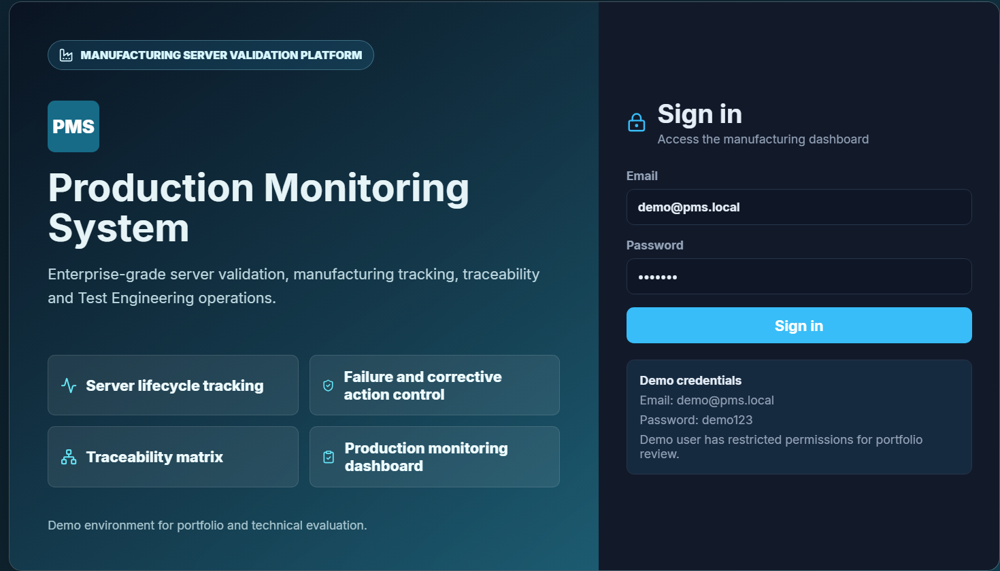
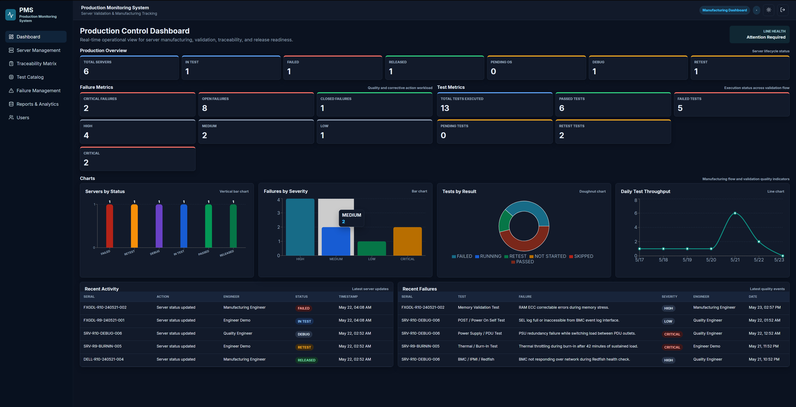
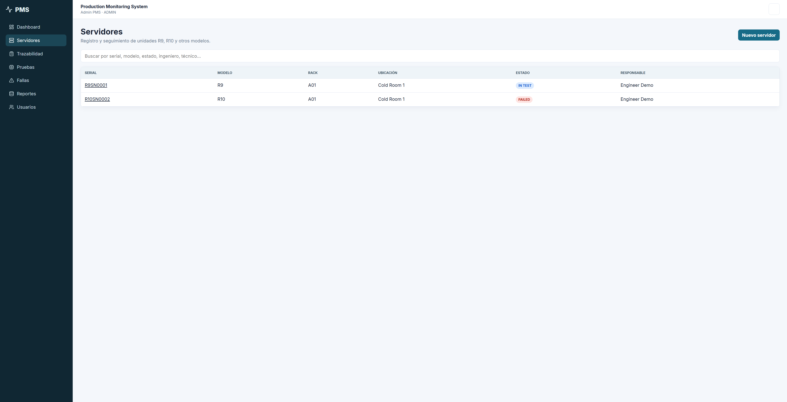
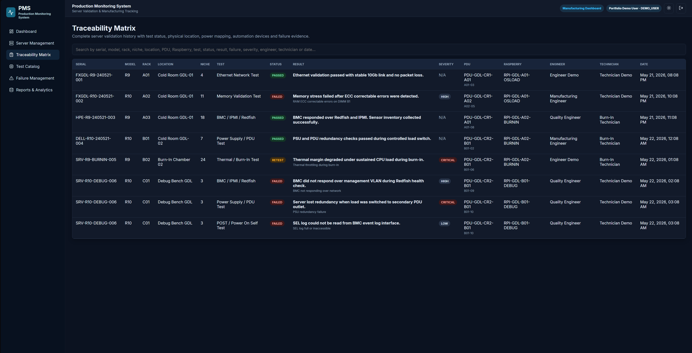
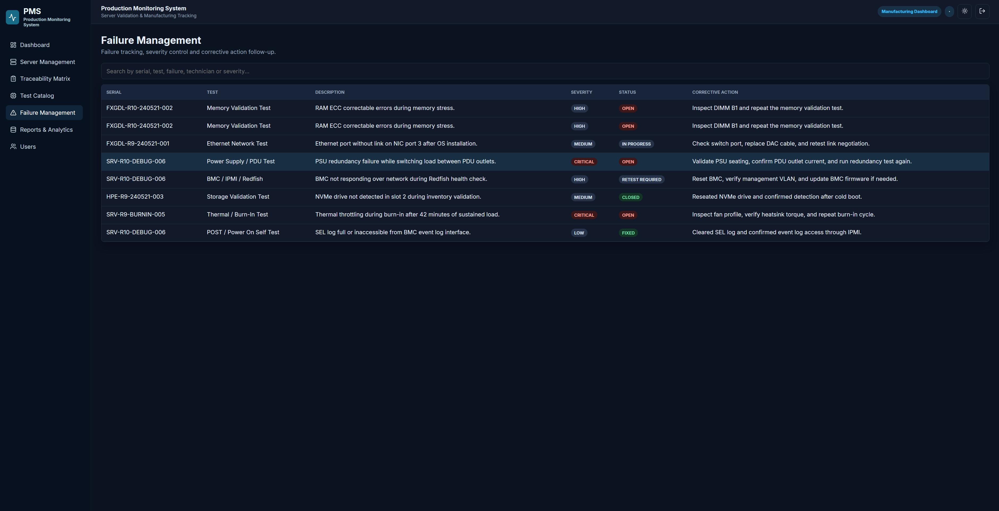
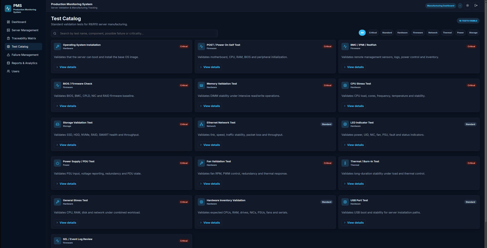
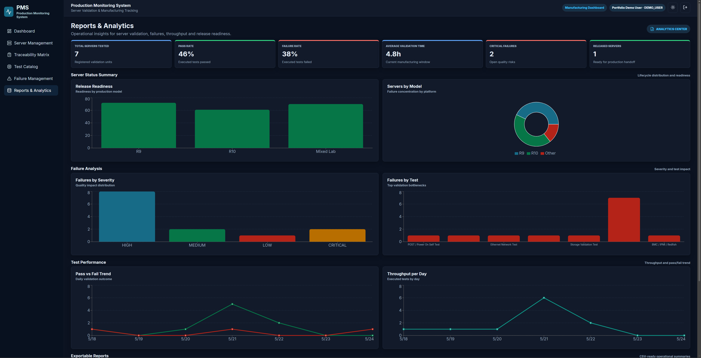
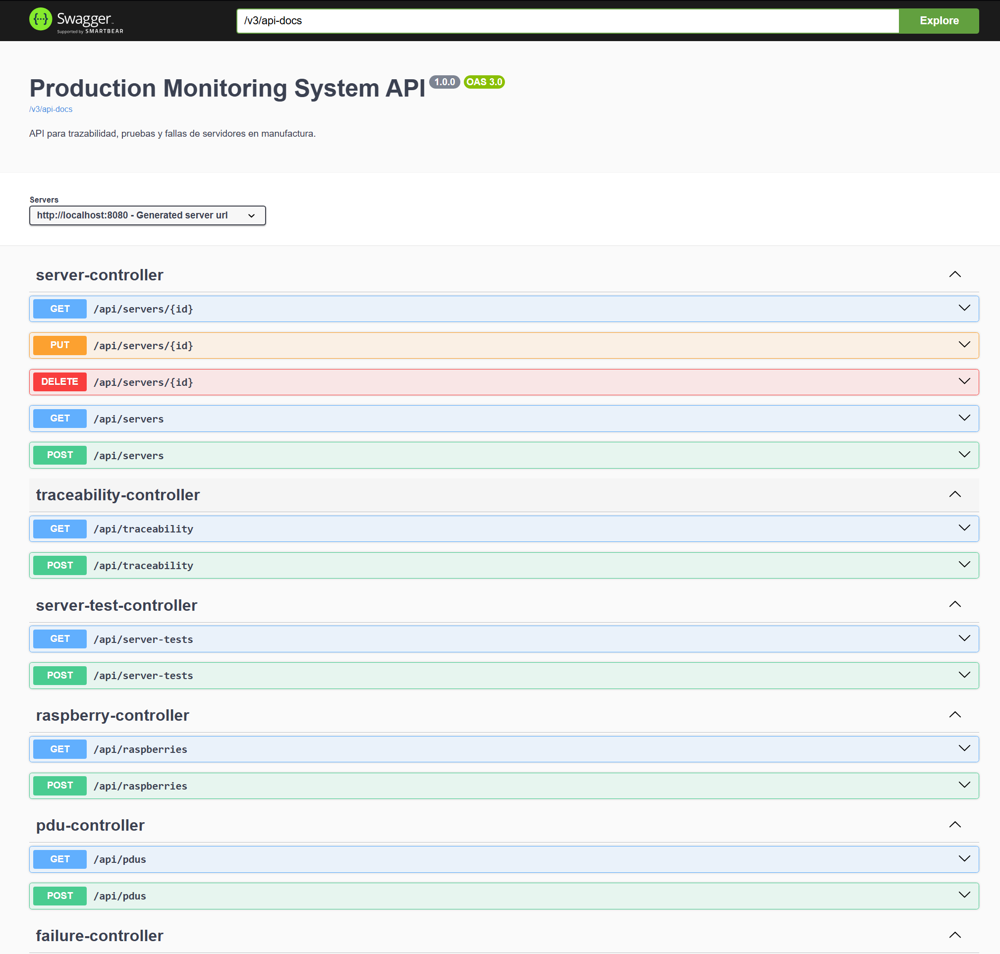
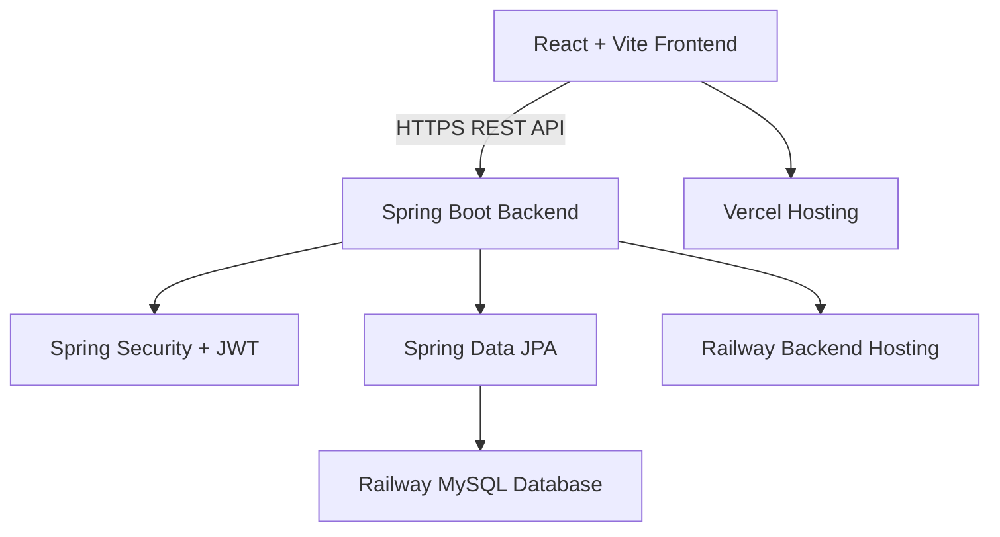

# Production Monitoring System (PMS)


Enterprise-style Full Stack platform for manufacturing server validation, production monitoring, traceability, failure management, and Test Engineering workflows.

Production Monitoring System is inspired by real Test Engineering (TE) and manufacturing workflows used in high-volume server validation environments, including lifecycle tracking, traceability, corrective actions, and production monitoring.

> Portfolio project focused on Java Backend Development, Full Stack Engineering, Manufacturing Systems, Test Engineering workflows, and enterprise REST API design.

---

## Live Demo

| Resource | URL |
| --- | --- |
| Frontend App | `https://production-monitoring-system-gamma.vercel.app` |
| Backend API Base URL | `https://production-monitoring-system-production.up.railway.app/api` |
| Swagger UI | `https://production-monitoring-system-production.up.railway.app/swagger-ui/index.html` |

### Demo Credentials

| Role | Email | Password |
| --- | --- | --- |
| DEMO_USER | `demo@pms.local` | `demo123` |

This account is intended for portfolio review only and has restricted permissions to protect demo data.

---

## Screenshots

### Login Page


### Production Dashboard


### Server Management


### Traceability Matrix


### Failure Management


### Test Catalog


### Reports & Analytics


### Swagger API Documentation


---

## Key Features

- 🔐 **JWT Authentication**: Secure login flow with token-based authorization.
- 🧑‍💼 **Role-Based Access Control**: Admin and restricted demo access for safer public portfolio review.
- 🖥️ **Server Lifecycle Tracking**: Monitor units from intake through validation, debug, retest, passed, and released states.
- 🧪 **Validation Test Management**: Track server test execution, status, results, evidence, and responsible owners.
- ⚠️ **Failure Management**: Register failures with severity, status, corrective action, technician ownership, and log references.
- 🧾 **Traceability Matrix**: Maintain serial-level history across server, rack, PDU, Raspberry device, test, engineer, technician, and result data.
- 📊 **Production Monitoring Dashboard**: Operational KPIs, status charts, failure metrics, test metrics, and recent activity.
- 📈 **Reports & Analytics**: Manufacturing-focused reporting for failure trends, model analysis, release readiness, and CSV exports.
- 🔎 **Search and Filtering**: Enterprise-style filtering across servers, failures, traceability, reports, and test catalog modules.
- 📚 **Swagger/OpenAPI Documentation**: REST API documentation for technical evaluation and backend review.
- 📱 **Responsive UI**: Clean interface designed for desktop review and responsive portfolio presentation.
- 🧱 **Layered Backend Architecture**: Controllers, services, repositories, DTOs, mappers, security, exceptions, and configuration.

---

## Architecture Overview

Production Monitoring System follows a modern Full Stack architecture designed for a production-style portfolio deployment. The React + Vite frontend is deployed on Vercel and consumes secured REST endpoints through Axios. The Spring Boot REST API is deployed on Railway and uses Spring Security with JWT for authentication and authorization. Persistence is handled through Spring Data JPA, with operational data stored in a Railway-hosted MySQL database.



This architecture separates the user interface, API layer, security layer, persistence layer, and managed database infrastructure. It demonstrates a recruiter-friendly deployment model that reflects how enterprise internal tools are commonly structured across frontend hosting, backend services, and relational data storage.

---

## Tech Stack

### Frontend

| Technology | Purpose |
| --- | --- |
| React | Component-based user interface |
| Vite | Fast frontend development and production build |
| JavaScript | Frontend application logic |
| CSS | Custom enterprise UI styling and dark mode |
| Axios | REST API communication |
| React Router | Client-side routing |
| Recharts | Dashboard and analytics charts |
| Lucide React | Professional UI icons |

> Note: The current repository implementation uses React with JavaScript and custom CSS. TypeScript and TailwindCSS can be added as future frontend modernization improvements.

### Backend

| Technology | Purpose |
| --- | --- |
| Java 17 | Backend language and runtime |
| Spring Boot | REST API application framework |
| Spring Web | HTTP controllers and REST endpoints |
| Spring Security | Authentication and authorization |
| JWT | Stateless user authentication |
| Spring Data JPA | Persistence and repository layer |
| Spring Validation | Request validation |
| Maven | Dependency management and build tool |
| Swagger/OpenAPI | API documentation |

### Database

| Technology | Purpose |
| --- | --- |
| MySQL | Relational database for operational records |
| Railway MySQL | Production database hosting |
| Docker Compose | Local MySQL development environment |

### Deployment

| Platform | Purpose |
| --- | --- |
| Vercel | Frontend deployment |
| Railway | Backend deployment |
| Railway MySQL | Managed production database |
| GitHub | Source control and portfolio hosting |

---

## Local Installation

### 1. Clone the Repository

```bash
git clone https://github.com/Daniel-Lopez-Pantoja/production-monitoring-system.git
cd production-monitoring-system
```

### 2. Start MySQL Locally

```bash
docker compose up -d
```

Default local database:

```text
Database: production_monitoring
Username: root
Password: root
```

### 3. Configure Backend Environment

Create or configure backend environment variables using your IDE, terminal, Railway variables, or `application.yml` defaults:

```env
DB_URL=jdbc:mysql://localhost:3306/production_monitoring?createDatabaseIfNotExist=true&useSSL=false&allowPublicKeyRetrieval=true&serverTimezone=UTC
DB_USERNAME=root
DB_PASSWORD=root
JWT_SECRET=change-this-demo-jwt-secret-before-deployment-please
JWT_EXPIRATION_MS=86400000
```

### 4. Run the Backend

```bash
cd backend
mvn spring-boot:run
```

Backend API:

```text
http://localhost:8080/api
```

Swagger UI:

```text
http://localhost:8080/swagger-ui.html
```

### 5. Configure Frontend Environment

Create a `.env` file inside the `frontend` directory:

```env
VITE_API_URL=http://localhost:8080/api
```

### 6. Run the Frontend

```bash
cd frontend
npm install
npm run dev
```

Frontend URL:

```text
http://localhost:5173
```

### 7. Log In

Use the restricted demo account for portfolio review:

```text
Email: demo@pms.local
Password: demo123
```

---

## Environment Variables

### Frontend `.env`

```env
VITE_API_URL=https://production-monitoring-system-production.up.railway.app/api
```

### Backend Environment Variables

```env
DB_URL=jdbc:mysql://your-mysql-host:3306/production_monitoring
DB_USERNAME=your_database_username
DB_PASSWORD=your_database_password
JWT_SECRET=replace-with-a-secure-production-secret
JWT_EXPIRATION_MS=86400000
```

---

## API Documentation

Swagger UI is available after starting the backend:

```text
http://localhost:8080/swagger-ui.html
```

Production Swagger URL:

```text
https://production-monitoring-system-production.up.railway.app/swagger-ui/index.html
```

### Main API Endpoints

| Method | Endpoint | Description |
| --- | --- | --- |
| POST | `/api/auth/login` | Authenticates a user and returns a JWT |
| POST | `/api/auth/register` | Registers a new user using an admin account |
| GET | `/api/dashboard` | Retrieves production dashboard metrics |
| GET | `/api/servers` | Retrieves all registered servers |
| POST | `/api/servers` | Creates a server record |
| GET | `/api/servers/{id}` | Retrieves a server by ID |
| PUT | `/api/servers/{id}` | Updates an existing server |
| DELETE | `/api/servers/{id}` | Deletes a server |
| GET | `/api/tests` | Retrieves the validation test catalog |
| GET | `/api/server-tests` | Retrieves server test execution records |
| POST | `/api/server-tests` | Registers a server test result |
| GET | `/api/traceability` | Retrieves the traceability matrix |
| POST | `/api/traceability` | Creates a traceability record |
| GET | `/api/failures` | Retrieves registered failures |
| POST | `/api/failures` | Registers a new failure |
| GET | `/api/reports/servers-by-status` | Retrieves server status metrics |
| GET | `/api/reports/failures-by-test` | Retrieves failure counts by test |
| GET | `/api/reports/failures-by-model` | Retrieves failure counts by server model |
| GET | `/api/pdus` | Retrieves registered PDUs |
| GET | `/api/raspberries` | Retrieves registered Raspberry devices |

The Postman collection is available at:

```text
docs/postman_collection.json
```

---

## Project Structure

```text
Production Monitoring System/
├── backend/
│   ├── src/main/java/com/production/monitoring/
│   │   ├── config/              # Application configuration and seed data
│   │   ├── controller/          # REST API controllers
│   │   ├── dto/                 # Request and response DTOs
│   │   ├── exception/           # Centralized exception handling
│   │   ├── mapper/              # Entity-to-DTO mapping helpers
│   │   ├── model/
│   │   │   ├── entity/          # JPA entities
│   │   │   └── enums/           # Domain enums
│   │   ├── repository/          # Spring Data JPA repositories
│   │   ├── security/            # JWT filters and security services
│   │   └── service/             # Business logic layer
│   └── pom.xml
│
├── frontend/
│   ├── src/
│   │   ├── api/                 # Axios client and API calls
│   │   ├── components/          # Shared layout and UI components
│   │   ├── context/             # Authentication and theme context
│   │   ├── pages/               # Application views
│   │   └── styles.css           # Global enterprise UI styling
│   ├── package.json
│   └── vite.config.js
│
├── docs/
│   ├── images/                  # Portfolio screenshots
│   └── postman_collection.json
│
├── docker-compose.yml
├── .env.example
├── .gitignore
└── README.md
```

---

## Security

The application uses JWT-based authentication with Spring Security. After login, the backend returns a signed token that the frontend sends with protected API requests.

### Access Model

| Role | Purpose |
| --- | --- |
| ADMIN | Full administrative access for local/internal use |
| ENGINEER | Validation, failure, test, and server workflow operations |
| TECHNICIAN | Test result updates and operational execution support |
| OPERATOR | Read-only operational visibility |
| DEMO_USER | Restricted public portfolio account for safe review |

The public demo account is intentionally restricted. Admin, engineer, technician, and operator credentials are not published for security reasons.

### Security Practices Demonstrated

- Stateless authentication with JWT.
- Role-based access control.
- Restricted public demo account.
- Environment-based secret configuration.
- Protected administrative operations.
- No production credentials committed to the repository.

---

## Business Value

This project demonstrates how software engineering can support real manufacturing and Test Engineering workflows. It goes beyond a basic CRUD application by modeling operational states, validation tests, server traceability, failure lifecycle management, corrective actions, reporting metrics, and production readiness visibility.

It is especially relevant for roles involving:

- Java Backend Development
- Full Stack Development
- Enterprise Software Engineering
- Manufacturing Systems
- Test Engineering Tools
- Production Monitoring Platforms
- Internal Operations Dashboards

---

## Future Improvements

- Advanced production charts with configurable date ranges.
- Real-time monitoring using WebSockets or Server-Sent Events.
- Exportable PDF and Excel reports.
- Email or Slack notifications for critical failures.
- KPI dashboard for throughput, yield, release readiness, and failure aging.
- Historical analytics by model, test type, severity, rack, and cold room.
- Audit trail for user actions and status changes.
- Evidence/log file upload with cloud storage integration.
- CI/CD pipeline with automated backend and frontend checks.
- Automated integration tests for authentication, authorization, and business rules.

---

## Author

**Danny Lopez Pantoja**

Computer Engineering | Software Developer

GitHub: [Daniel-Lopez-Pantoja](https://github.com/Daniel-Lopez-Pantoja)

---

## Suggested Commit

```bash
docs(readme): modernize portfolio documentation
```
